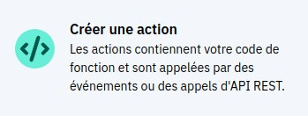

### Créer une cloud function de type action

Démarrer  [ici](https://cloud.ibm.com/functions/actions)

#### Verifier la région

>:warning: Selectionner la même région (e.g. eu-de) que celle de Watson Assistant.


#### Créer l'action





#### Coller ou écrire le code dans l'éditeur


#### Récupérer l'URL de l'action


#### Récupérer l'APIKEY de l'action

Naviguer jusqu'[ici](https://cloud.ibm.com/functions/namespace-settings)


#### Tester l'action avec curl ou postman


```
APIKEY="userid:password"
ORG="sebastien.gautier%40fr.ibm.com"
SPACE="dev"
ACTION_NAME="action"
REGION="eu-de"
URL="https://"$REGION".functions.cloud.ibm.com"
METHOD="api/v1/namespaces/"$ORG"_"$SPACE"/actions/"$ACTION_NAME"?blocking=true"

cat > params.json << EOF
{
    "array0": [
        "item0",
        "item1",
        "item2"
    ]
}
EOF


curl -X POST -H 'Content-Type: application/json' -u $APIKEY -d @params.json $URL/$METHOD | jq -r .response.result

```


### Dans Watson Assistant

#### Générer un object credential dans un object private

```
APIKEY="userid:password"
USER=$(echo $APIKEY | awk -F ':' '{print $1}')
PASSWORD=$(echo $APIKEY | awk -F ':' '{print $2}')

cat > credential.json << EOF
{
    "private": {
        "credential": {
        "user": "$USER",
        "password": "$PASSWORD"
        }
    }
}
EOF

jq . credential.json
```


#### Coller le fichier généré dans un noeud au dessus du noeud d'appel de l'action à l'aide de l'éditeur JSON

>:warning: Placer le credential dans un noeud au dessus du noeud d'appel de l'action


#### Générer un object action de type tableau 


```
ORG="sebastien.gautier@fr.ibm.com"
SPACE="dev"
ACTION="mapping0"
NAME="/"$ORG"_"$SPACE"/"$ACTION

cat > actionCall.json << EOF
{
    "actions": [
        {
            "name": "$NAME",
            "type": "cloud_function",
            "parameters": {
            	"listeDepassements": "\$listeDepassements"
        	},
        	"credentials": "\$private.credential",
        	"result_variable": "context.result"
        }
    ]
}
EOF

jq . actionCall.json
```

#### Coller le fichier généré dans un noeud au dessus du noeud d'appel de l'action à l'aide de l'éditeur JSON

>:warning: Placer l'appel de l'action dans un noeud au dessous du noeud du credential.


